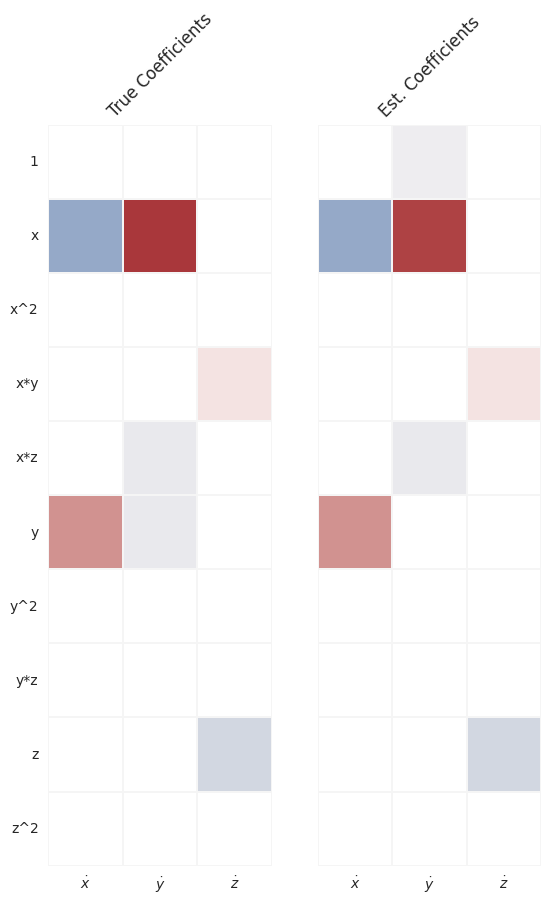
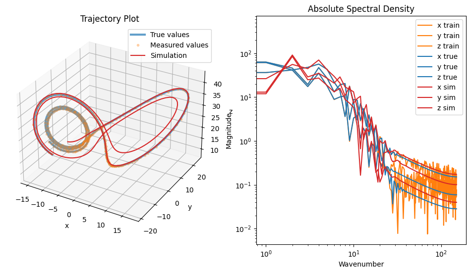
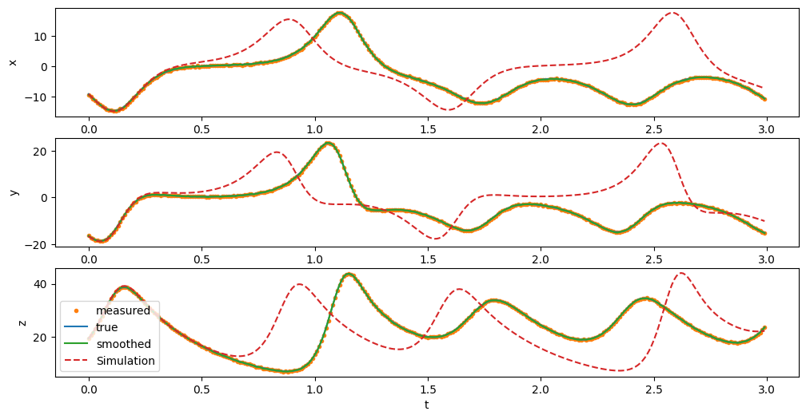

# Overview

A library for constructing dynamics experiments from the dynamics models in the `dysts` package.
This includes data generation and model evaluation.
The first contribution is the static typing of trajectory data (`ProbData`) that, I believe, provides the necessary information to be useful in evaluating a wide variety of dynamics/time-series learning methods.
The second contribution is the collection of utility functions for designing dynamics learning experiments.
The third contribution is the collection of such experiments for evaluating dynamics/time-series learning models that meet the `BaseSINDy` API.

It aims to (a) be amenable to both `numpy` and `jax` arrays, (b) be usable by any dynamics/time-series learning models that meet the `BaseSINDy` or scikit-time API.
Internally, this package is used/will be used in benchmarking pysindy runtime/memory usage and choosing default hyperparameters.

## Getting started

Install with `pip install sindy-exp` or `pip install sindy-exp[jax]`.

Generate data

    data = sindy_exp.data.gen_data("lorenz", num_trajectories=5, t_end=10.0, dt=0.01)["data]

Evaluate your SINDy-like model with:

    sindy_exp.odes.fit_eval(model, data)

A list of available ODE systems can be found in `ODE_CLASSES`, which includes most
of the systems from the [dysts package](https://pypi.org/project/dysts/) as well as some non-chaotic systems.

## ODE & Data Model

Generated or measured data has the dataclass type `ProbData` or `SimProbData`, respectively,
to indicate whether it includes ground truth information and a noise level.
If the data is generated in jax, it will have an integrator that can later be used to evaluate the true data on collocation points.

We deal primarily with autonomous ODE systems of the form:

    dx/dt = sum_i f_i(x)

We represent ODE systems as a list of right-hand side expressions.
Each element is a dictionary mapping a term (Sympy expression) to its coefficient.
Thus, the rhs of an ODE is of type: `list[dict[sympy.Expr, float]]`

## Other useful imports, compatibility, and extensions

* The experiments are built to be compatible with the `mitosis` tool, an experiment runner.  Mitosis is not a dependency, however, to allow using other experiment runners.
* To integrate your own experiments or data generation in a way that is compatible, see the `ProbData`, `SimProbData`, `DynamicsTrialData`, and `FullDynamicsTrialData` classes.
* For plotting tools, see `plot_coefficients`, `compare_coefficient_plots_from_dicts`, `plot_test_trajectory`, `plot_training_data`, and `COLOR`.
* For evaluation of models, see `coeff_metrics`, `pred_metrics`, and `integration_metrics`.

